# ChatApp!


ChatApp is a real-time messaging application that utilizes the Socket.io library
to enable bidirectional and event-based communication. Chat rooms created by an admin (the person originating the chat),
are restricted to chat participants who have been invited through the app via email.

The back-end of ChatApp is built on NodeJs and Express. Front-end display templates are compiled with Handlebars,
and the front-end logic is primarily Plain Vanilla Javascript (with a little JQuery sprinkled about).

## Primary Dependencies

- [NodeJS](https://nodejs.org/) v12.18.3
- [Socket.io](https://socket.io/) v2.3.0
- [Socket.io-client](https://socket.io/docs/v3/client-api/) v2.3.1
- [Express](https://expressjs.com/) v4.17.1
- [Express-handlebars](https://www.npmjs.com/package/express-handlebars) v5.2.0
- [Googleapis](https://www.npmjs.com/package/googleapis) v66.0.0
- [Nodemailer](https://nodemailer.com/about/) v6.4.13
- [Node-sass](https://www.npmjs.com/package/node-sass) v5.0.0
- [Jest](https://jestjs.io/) v26.4.2
- [Supertest](https://www.npmjs.com/package/supertest) v6.1.1

## Requirements

#### Gmail API Authorization

[Nodemailer](https://nodemailer.com/about/) is a module for Node.js applications to allow "easy as cake" email sending. This module is incredibly simple to use
and can be easily customized to use whichever email service you want to connect to (Gmail, SendGrid, MailChimp, MoonMail, etc).      

ChatApp is currently set up to use Nodemailer's [3-legged OAuth2 authentication method](https://nodemailer.com/smtp/oauth2/) with Gmail API access tokens for sending chat room invitations.
If you want to use Gmail, you'll need to [implement server-side authorization](https://developers.google.com/gmail/api/auth/web-server) for the app to use the [Gmail API](https://developers.google.com/gmail/api).

#### Environment Variables

The following environment variables must be set for the app to function. ChatApp utilizes the dotenv module to load environment variables from a .env file into process.env.  
    
During development, create a file ".env" in the root project directory and include the following environment variables.
When deploying the application to a serverless platform, you'll utilize the platform's 

**APP_NAME**=The name of your application (e.g. ChatApp)  
**EMAIL**=The Google email used for sending invites. It must be the email address associated with your Google token below (e.g. your.email@your-domain.com)  
**TEST_EMAIL**=The email account that will receive confirmation of successful integration testing of the mail functionality (e.g. your.email@your-domain.com)   
**REFRESH_TOKEN**=The refresh token from Google. It's gonna be quite long.  
**CLIENT_SECRET**=The client secret from Google. Relatively short.  
**CLIENT_ID**=the client ID from Google. Medium length.  
**SCHEME**=http or https (omit the ://)  
**DOMAIN**=your.domain@here.com (don't include the scheme or ://)  

## Running Locally

Make sure you have [NodeJS](https://nodejs.org/) and [npm](https://www.npmjs.com/) installed.

1. Clone or Download the repository
    ```
    $ git clone https://github.com/newsproutsmedia/chat.git
    $ cd chat
    ```

2. Install Dependencies
    ```
    $ npm install
    ```
3. Start the Application
    ```
   $ npm run dev
   ```
   
The application should now be running on [localhost:3000](http://localhost:3000).

## Styles

Styles are compiled using the stylesheet preprocessor, [Sass](https://sass-lang.com/).
All .scss files can be found in the "scss" directory.

The compiled stylesheet will be output to "public/css/styles.css". **DO NOT** edit the compiled stylesheet! 
Why? You'll be sad when all of your edits are overwritten the next time you run the compiler. And I don't want you to be sad.

To Compile Styles:
```
npm run scss
```

## Persistence

Data persistence is currently in-memory only. More permanent persistence can be easily achieved by modifying the
repository files, located (as one might expect) in the "repositories" directory.

## Code Coverage

Code coverage utilizes [Jest](https://jestjs.io/), a "delightful Javascript Testing Framework" developed by Facebook. Coverage is primarily achieved
with integration testing, although some unit tests exist as well.  

Code coverage currently sits at **96%**.

## Continuous Integration

ChatApp includes a YAML configuration file for use with [CircleCI](https://circleci.com/),
a fantastic continuous integration and continuous delivery (CI/CD) platform. CircleCi makes it simple
to [integrate with GitHub](https://circleci.com/integrations/github/) and automate your testing, builds, and deployment.

## Future Features
Features will continue to be added, including:
- Clicking on a user's message count will show only that user's messages
- Initiate a "sidebar" chat with a single user
- Option to make a chat room "public"
- Password protection
- Encrypted chat (including option to encrypt invitation using both encrypted text and end-to-end encryption)
- Multiline input
- Flag messages as inappropriate

## Using the Application

#### Start A Chat
Start a chat room by entering your nickname (username) and email address.  

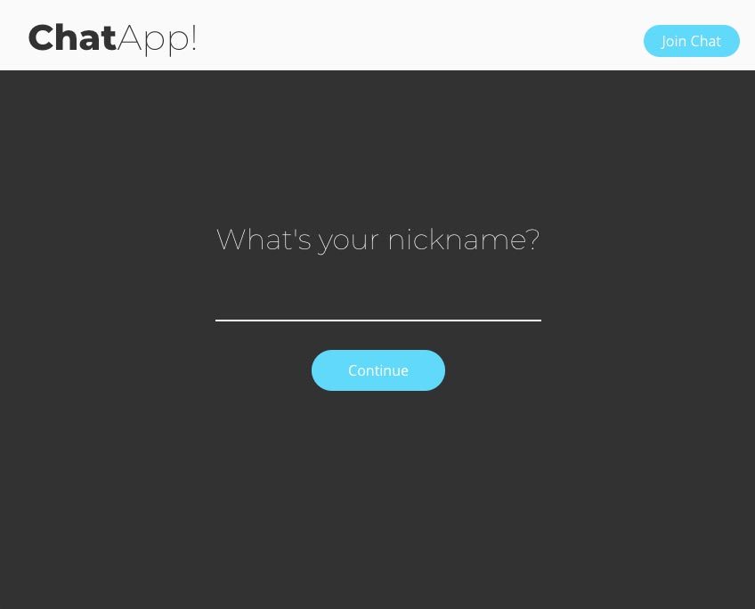

You'll be taken to the chat page.

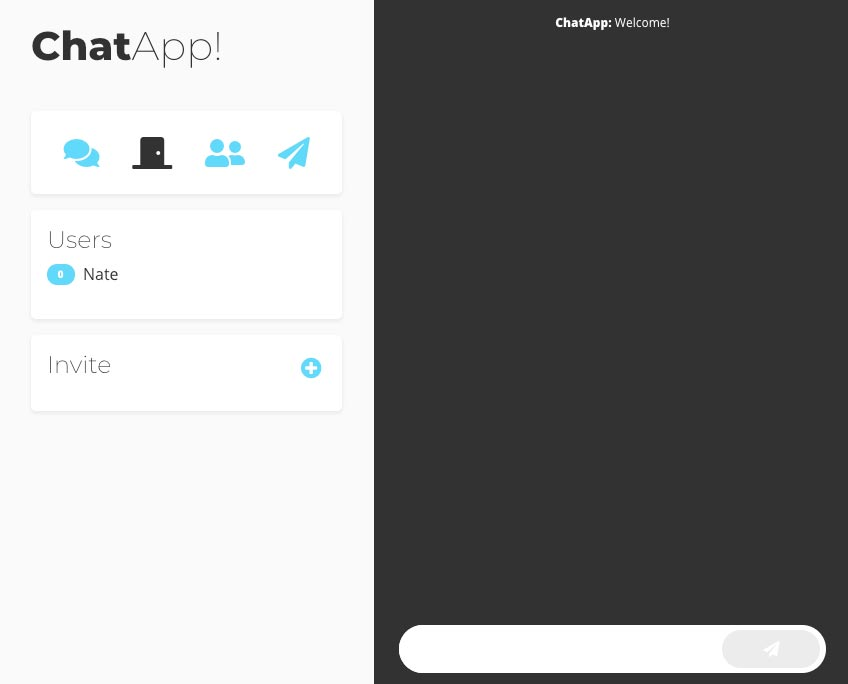

#### Inviting Chat Participants

To initiate a chat, invite some folks! This is an important step, as only invited users can enter a chat room. Click the "+" button
adjacent to "Invite" in the invitations section of the dashboard. A new field will appear.

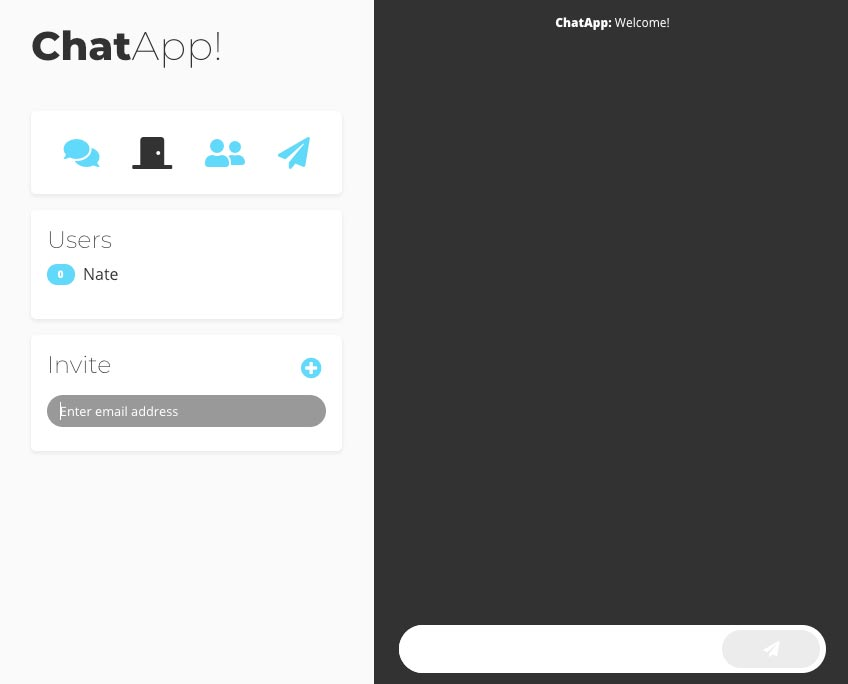

You can invite more than one person at a time by clicking the "+" button again. Don't worry about trying
to invite everyone at once. You can invite others at any time. Click the "Send Invites" button to send the
invitation emails.

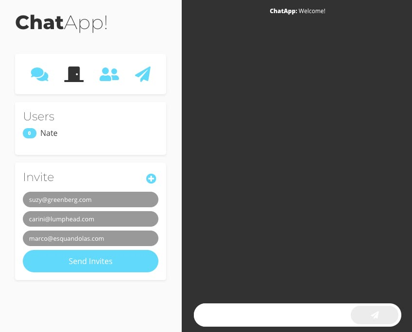

You'll see a "Pending" badge next to each email as the system processes the invitations and sends
the emails. As each email is successfully sent, the invite will move up to the "Users" section and
the messages badge will be highlighted in green.


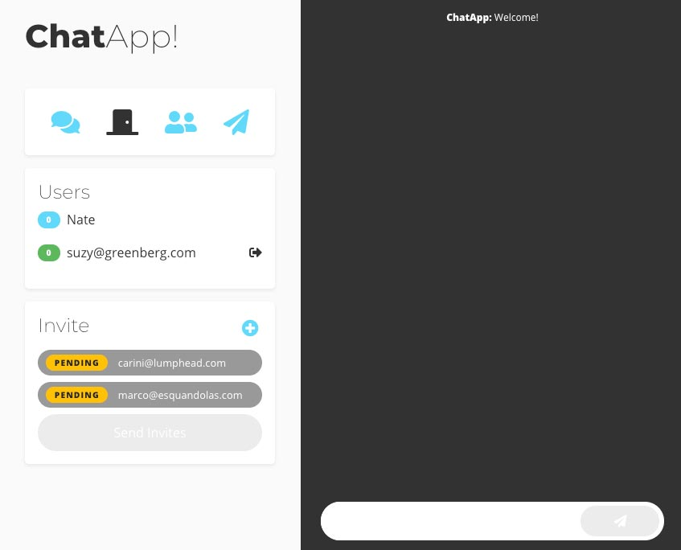

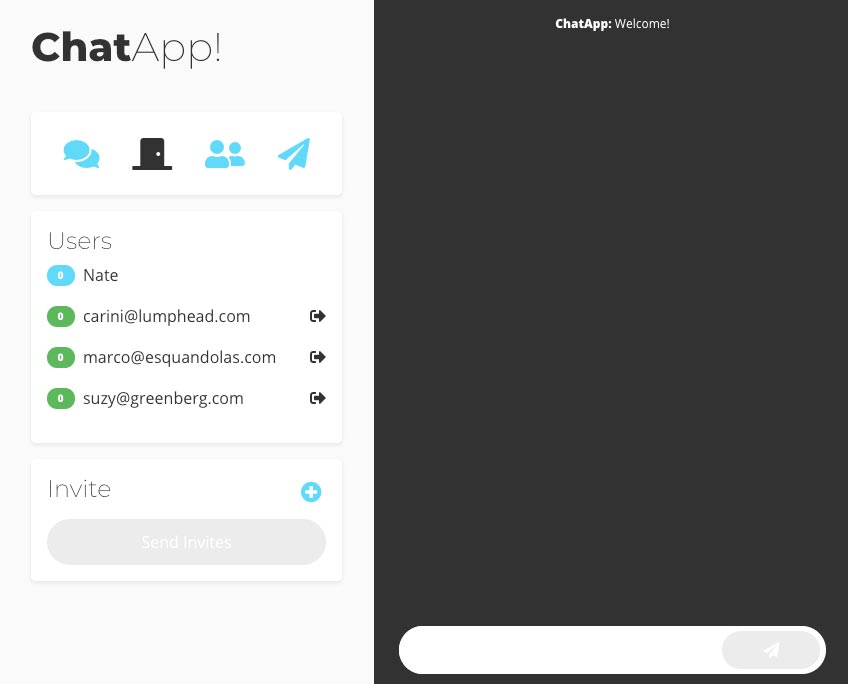

When you've finished inviting everyone, you can hide the "Invite" section by clicking on the paper
airplane icon at the top of the dashboard.
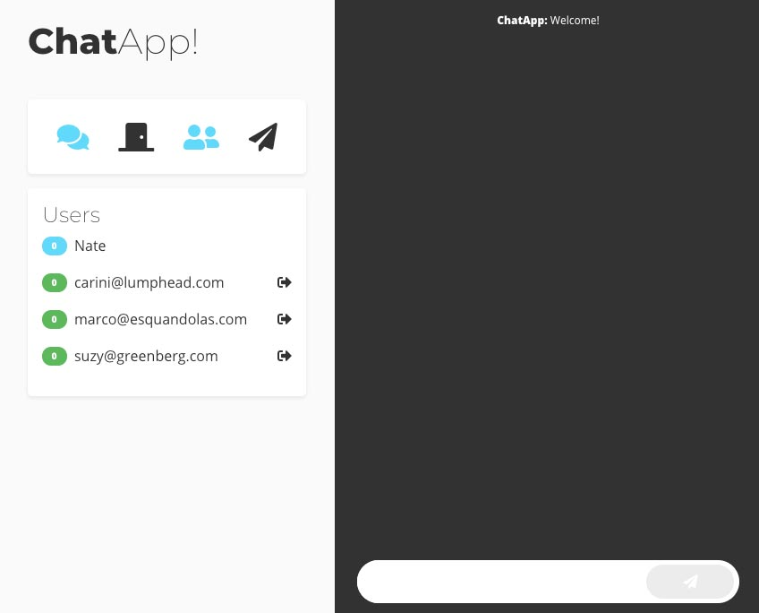

#### Joining A Chat
Invited participants will receive an email containing an invitation along with a link to the
"Join" page. The link will contain the chat room id (generated by the system when the
room was created) and the user's email address. Clicking on the link will take the user to the
"Join" page with room and email pre-populated.

The joining user enters their preferred nickname and clicks "Join Chat" to enter the chat room.
Usernames must be unique.

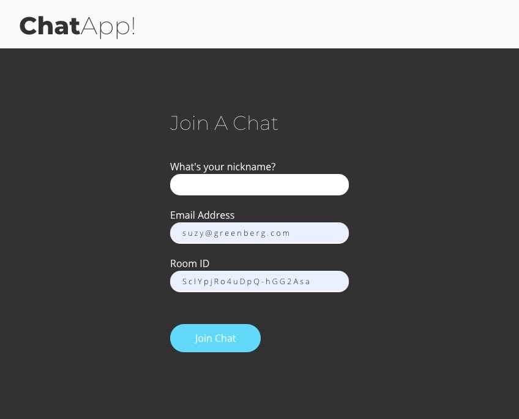
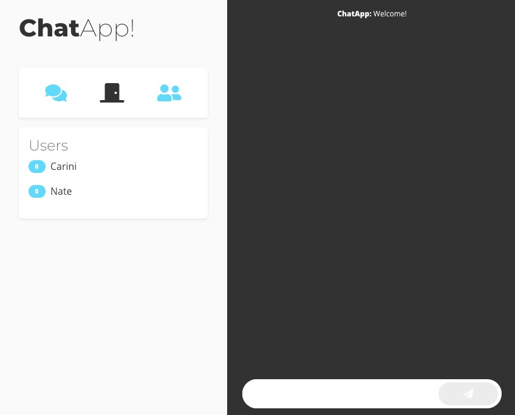

#### Sending Messages
Enter text in the input box at the bottom of the screen and press the button to send the message.

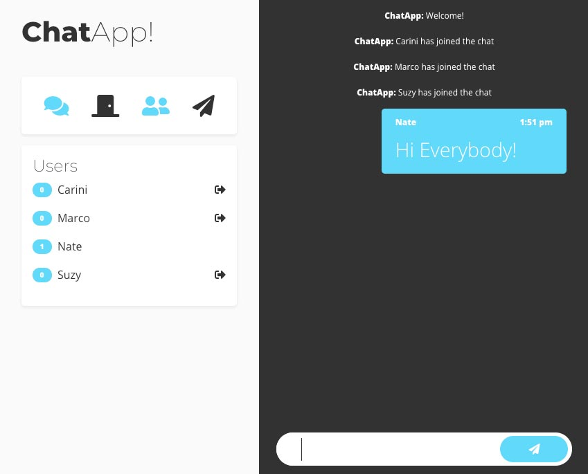

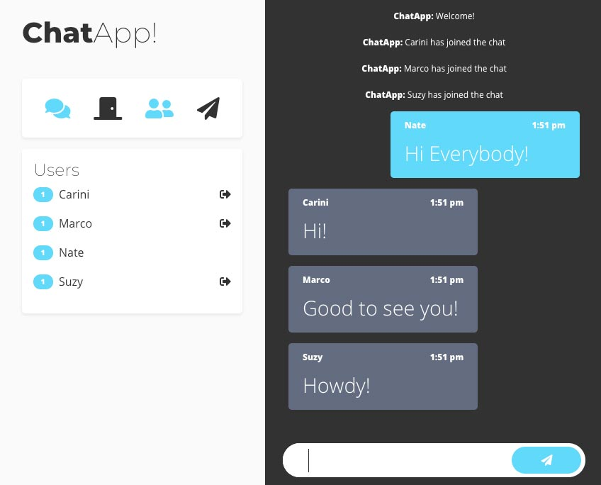


#### Leaving The Chat Room
To leave the chat, click on the door icon followed by the "Leave Room" button.

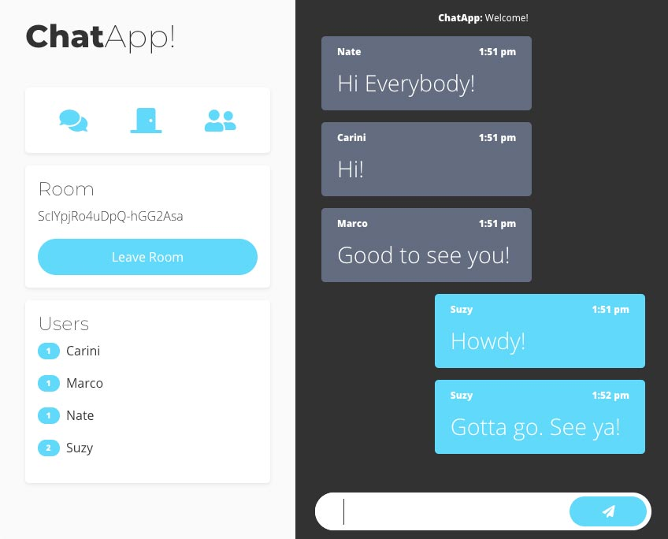

Other users will receive a notification, and the messages badge next to the disconnected user's name will
be greyed out.

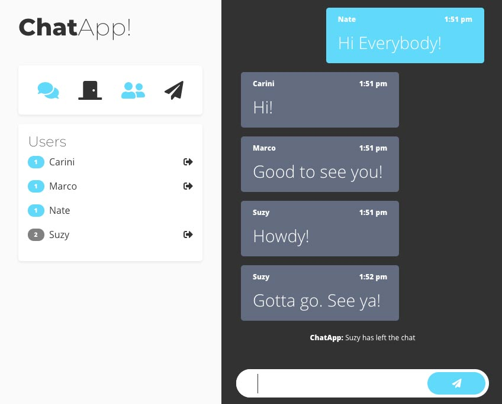

#### Blocking A User
The chat admin can block a user by clicking on the exit icon to the right of their name. The system
will prompt the admin to confirm they want to block the user from the chat.
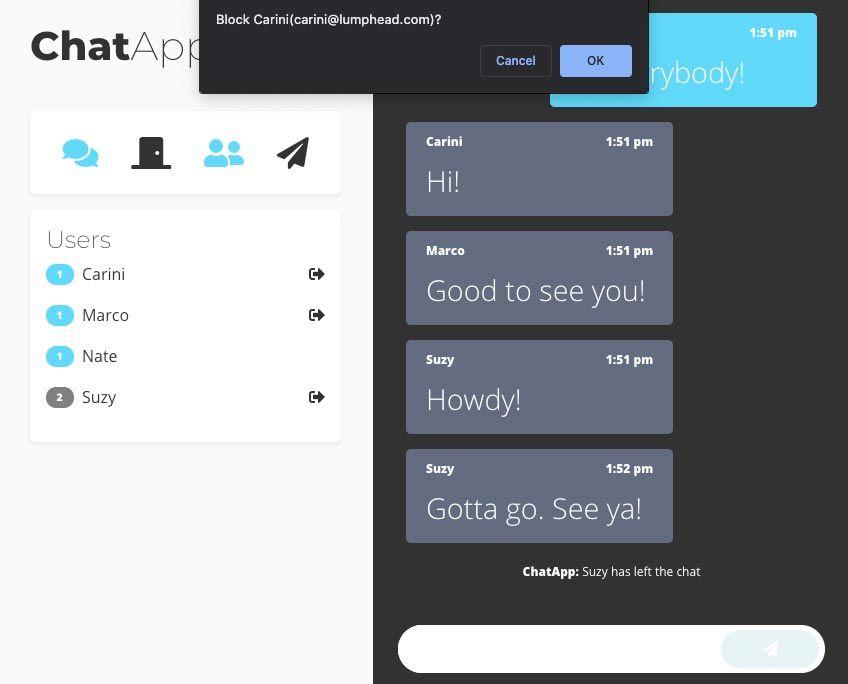

Blocking a user ejects them from the chat room. Blocked users cannot log back in to the chat. The badge next
to the blocked user's name displays red to indicate that they've been blocked.

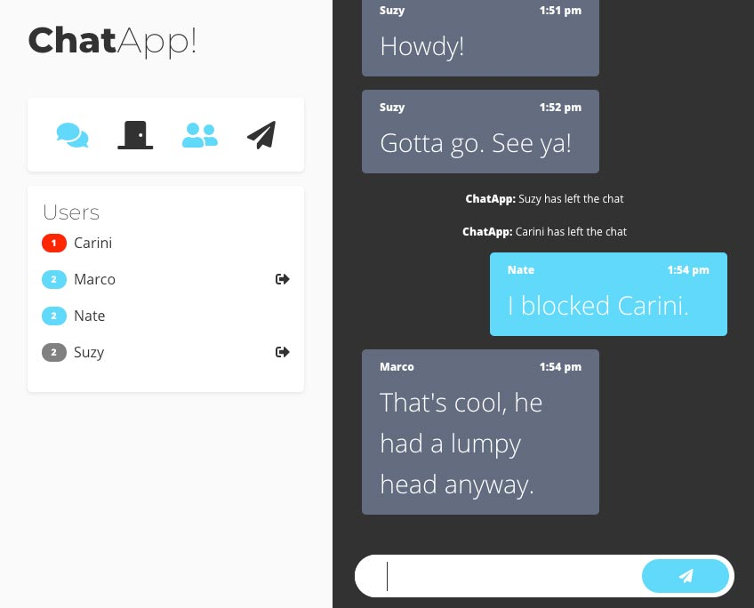

#### Mobile Menu
On mobile devices, the dashboard will be hidden. To access it, press the squares at the top-right corner of the page.
Pressing the "X" above the menu will hide it again.

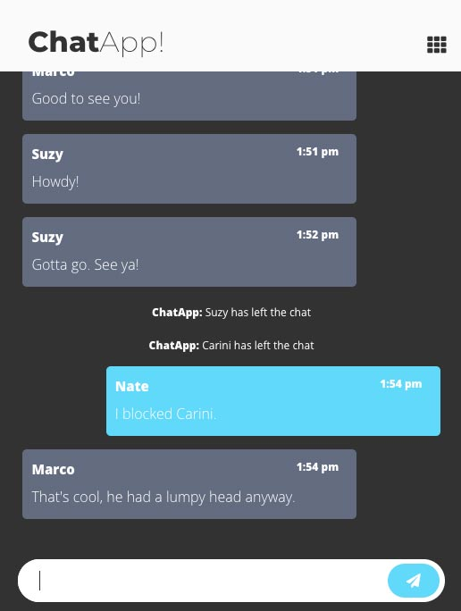

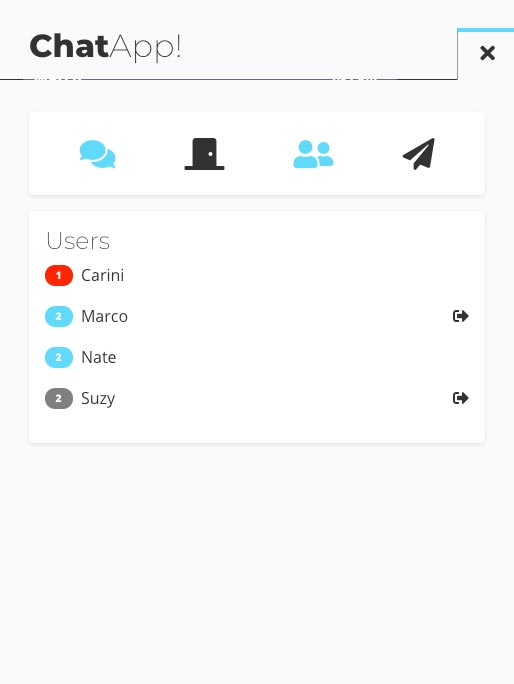